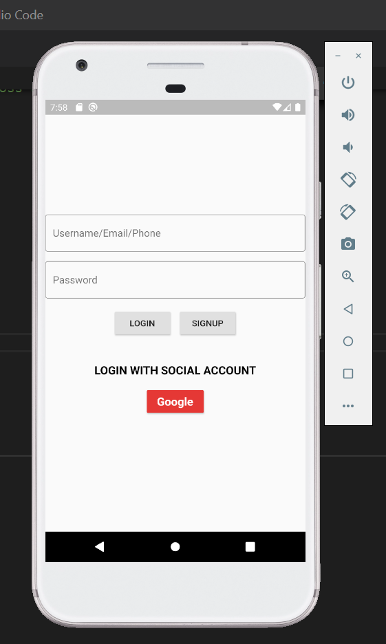

# Eliana

_Main Repository for WooTech Mentorship Programme - Project (Eliana)_

This is the repository that contains all the material/code required to get started with the mentorship programme. A few points of administration:

1. The length of the mentorship is around 8 weeks.

2. I assume you have some prior knowledge of programming.

3. For any help with the course, you can contact me on the Slack channel.

4. We'll be opening an issue for each new feature that needs to be added to the project.

Don't be afraid to ask any questions (however irrelevant you think it may be).

## Abstract
A chatbot app for girls and women to answer questions around taboo topics such as menstruation, pregnancy, abortion, STDs, depression, anxiety, etc. 
The frontend for the app will be built with Flutter (to develop a cross-platform app) and the bot will be built using Dialogflow.

## Prerequisites

1. Language: We will be using Dart (language used by Flutter to build apps) throughout this course. 

2. Flutter Installation (For tutorial refer week 1):

    a. [Windows](https://flutter.dev/docs/get-started/install/windows)
    
    b. [macOS](https://flutter.dev/docs/get-started/install/macos)
    
    c. [Linux](https://flutter.dev/docs/get-started/install/linux)

4. Tools:

    a. [Visual Studio Code](https://code.visualstudio.com/download)
    
    b. git: You'll be using GitHub to build the project, so learn the basics of git: pull, push, add, commit.

## Resources

Since every one prefers a different approach to learning, I'm gonna try my best to accomodate each style. Every topic has multiple levels of resources:

1. Articles/Blogs: This will give you a detailed explanation for each topic alongwith the relevant mathematics.

2. Code: If you prefer to learn by looking at the codebase, I'll link practical implementations of the topic(wherever appropriate).

3. Lectures: I'll link free online YouTube lectures (wherever appropriate).

## Detailed Breakdown

### WEEK 1

Flutter Installation and Setup

1. [Windows](https://www.youtube.com/watch?v=M3UfYS0bqhE&list=PLRAV69dS1uWT-ooTYHCqgxMTGA233JMrP&index=4)
2. [macOS](https://www.youtube.com/watch?v=Xy-qHlaHr6c&list=PLRAV69dS1uWT-ooTYHCqgxMTGA233JMrP&index=2)

VSCode Setup

1. [Setup](https://www.youtube.com/watch?v=UgmKKtmgdKY&list=PLRAV69dS1uWT-ooTYHCqgxMTGA233JMrP&index=3)

### WEEK 2

Technically this week would've been an introduction to the Dart language and widgets in Flutter. But I believe in learning as we code. So we're gonna start with building our first Flutter App :)

Startup Name Generator
1. [Part 1](https://flutter.dev/docs/get-started/codelab)
2. [Part 2](https://codelabs.developers.google.com/codelabs/first-flutter-app-pt2/#0)

Basic UI for the chatbot

### WEEK 3

Dialogflow and Flutter

(To be followed till App's Integration with DialogFlow)
1. [Blog](https://ptyagicodecamp.github.io/implementing-flutter-factsbot-using-dialogflow.html)
2. [Lecture](https://www.youtube.com/watch?v=89XIlULDQKg)

After following the above blog add [this](https://gist.github.com/CheshtaK/c47f258abaf1a5c9af4d358e51024cb7) to your main.dart file.

### WEEK 4

Dialogflow - Build an agent from scratch

1. [Part 1](https://cloud.google.com/dialogflow/docs/tutorials/build-an-agent/)
2. [Part 2](https://cloud.google.com/dialogflow/docs/tutorials/build-an-agent/create-customize-agent)
3. [Part 3](https://cloud.google.com/dialogflow/docs/tutorials/build-an-agent/create-intent-with-parameters)

### WEEK 5

_Build the chatbot on Dialogflow_

### WEEK 6

_Build the chatbot on Dialogflow_

### WEEK 7

_UI for bot and Integrate Flutter and Dialogflow_

### WEEK 8

_Documentation, Testing, Finalizing_

## Future Work
Image labelling can be used to label fruits and vegetables and display their benefits and nutrition count for women.
